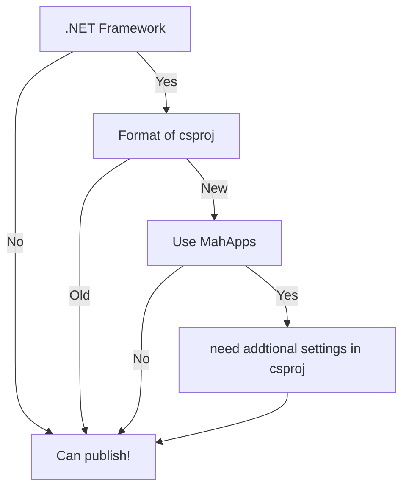

# [WPF] SingleExe on .NET Fw

2023.5.4(GW) ~

## 目的

.NET Fw 製の WPFアプリ を単一exeファイルにできるかを知りたい。

## 背景

- .NET 環境であればオプション1つで単一ファイルを生成できますが、.NET Fw の配布の手軽さには魅力があります。（ランタイムを必要とせず、単体exe を 小サイズで配布できます。）

- サポート終了日が 最新 .NET よりも .NETFw の方が長く、商用アプリの選択候補になり得ます。（MSからは推奨されていません）

## 検討まとめ

~~一言で書くと、.NET Fw で単一ファイルを作るなら [MahApps](https://github.com/MahApps/MahApps.Metro) の使用はあきらめよう。~~

.NET Fw でも単体ファイルを生成できます。 Publish すると他の dll も出力されるので自分で消しましょう。（ダサい

**うまくいった点**

- 旧型式の csproj で単一ファイルを作成できました。

- 新形式の csproj でも **~~MahApps を導入しなければ~~**、 単一ファイルを作成できました。


**うまくいかなかった点**

- 旧型式のcsproj では ソースジェネレータが動作しませんでした。CommunityToolKit は ViewModel を .NETStandard2.0 の別プロジェクトに分けることで対応しました。

### 単一ファル生成のフローチャート

ややこしい + Mermaid を使ってみたかったので整理しました。




### 新csproj + MahApps の対応メモ

ビルドエラーで困ったので対処法を記録しておきます。

**困ったこと**

- MahApps を導入すると（ColorPicker のローカライズのために）、ビルド成果物に `Culture=de` フォルダが生成されるようになります。[Issue #2315](https://github.com/MahApps/MahApps.Metro/issues/2315#issuecomment-914944785)

- すると、ビルド時に MSBuild が 自プロジェクト内に存在しない（妄想の）dll コピーを行おうと試みて、ファイルが存在しないエラー（MSB3030）が発生します。
- つまり根本的には Culture 要因であり、MahApps 以外のライブラリ導入時も問題になると思われます。
- 上記の通りビルドエラーは発生しますが exe は作成されており、その exe は単体で起動します。 とは言え、開発エクスペリエンスが激落ちくんで辛いです…

**対処法**

csproj に設定を追加することで対策できました。 ネットで調べても（ChatGPTに聞いても）対処法が見つからなかったので自力で生み出しました。

```xml
<Target Name="SuppressCopyOfSelfResourceDll" BeforeTargets="ComputeIntermediateSatelliteAssemblies">
  <ItemGroup>
    <EmbeddedResource Remove="@(EmbeddedResource)" />
  </ItemGroup>
</Target>
```

**対処法の生み出し作業メモ**

1. VisualStudio → オプション → ビルドして実行 → MSBuild プロジェクト ビルドの出力の詳細(V) を 最小（多分デフォ）から 診断（多分最も細かい）に変更しました。

2. コピーエラーの原因の妄想のファイル `WpfNewCsproj.resources.dll` が最初に出てくる行を調べると、`ComputeIntermediateSatelliteAssemblies` 処理によって 妄想ファイル が追加されてるっぽいことが分かりました。

3. VisualStudio のエラー表示をクリックすると ビルド元のスクリプトが表示されます。

   > "C:\Program Files\Microsoft Visual 
   >
   > Studio\2022\Community\MSBuild\Current\Bin\amd64\Microsoft.Common.CurrentVersion.targets"

4. ビルドスクリプトの `ComputeIntermediateSatelliteAssemblies` を見ると `EmbeddedResource` をトリガに妄想dll が追加されていることが分かります。

5. `csproj` に `ComputeIntermediateSatelliteAssemblies`  の前処理を追加して、`EmbeddedResource` をクリアします。（かなり力づく、 後処理で元の情報に戻してすらいません）

### 調査で知ったけど自分で試していないこと

- Microsoft純正ツールの [ILMerge](http://research.microsoft.com/en-us/people/mbarnett/ilmerge.aspx) を使用すると .NET アセンブリを単一ファイルにマージできるそうですが、XAML が含まれる WPF には対応していないらしいです。
- 今回試した方法は 混合モードアセンブリ だとうまく行かないらしい。(C++/CLI と結合できないってことだと思われる) 

## フレームワーク比較 (2023年5月時点)

.NET Fw のメジャーバージョンは リリースから 10年 サポートされるそうで、.NET LTS版の 3年 と比較して非常に長いです。

今のリリース計画が継続した場合、2025年リリースの .NET10 (LTS) の期限が 2028年 となり、その場合でも .NET Fw 4.8 のサポート期限（2029年予定）の方が長くなります。


|               | メモ                     | Windowsプレインストール | リリース日         | サポート期限       |
| ------------- | ------------------------ | ----------------------- | ------------------ | ------------------ |
| .NET 8 (予定) | 次のLTS                  | なし                    | 未定 (2023年11月?) | 未定 (2026年11月?) |
| .NET 6        | 現在のLTS                | なし                    | 2021年11月         | 2024年11月         |
| .NET Fw 4.8.1 | 最新のFw                 | なし                    | 2022年8月9日       | 未定 (2032年?)     |
| .NET Fw 4.8   | Win11プレインストール    | Win10, 11               | 2019年4月18日      | 未定 (2029年?)     |
| .NET Fw 4.6.2 | サポート終了公表済みのFw | Win10                   | 2016年8月2日       | 2027年1月12日      |

## References

[WPFアプリケーションをEXEひとつにまとめる - secretbase.log](https://cointoss.hatenablog.com/entry/2017/02/21/121209)

[Combining multiple assemblies into a single EXE for a WPF application | DigitallyCreated](http://www.digitallycreated.net/Blog/61/combining-multiple-assemblies-into-a-single-exe-for-a-wpf-application)

